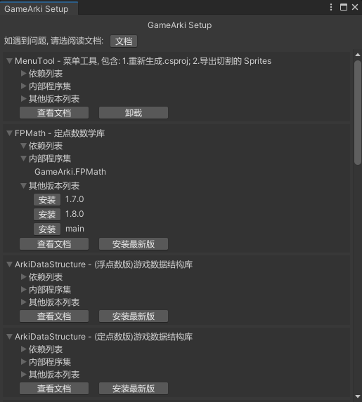

# GameArkiSetup
🍔 GameArki 安装工具

# 安装方式
1. 打开 Unity
2. 点击菜单: Window/Package Manager, 以打开管理器
3. 在管理器左上角点`+`号, 选择: "Add Package from git URL"
4. 将这一行粘贴 `ssh://git@github.com/gamearki/GameArkiSetup.git?path=Assets/com.gamearki.setup#main` 后, 点 Add

# 使用方式
1. 点击菜单: GameArki/SetupWindow
2. 按需安装想用的库  

# 常见报错
1. 确认电脑上是否安装 Git, 安装后记得重启电脑  
注: 是要装 Git 本体, 不是 SourceTree / Fork / SmartGit 等客户端  
2. 确认 Github 上是否配置了 SSH Key  
3. 确认是否能正常从 Github 拉取仓库, 有的运营商网络经常会访问失败  
- 以上方式都不能解决时, 可联系客服(杰克有茶): chenwansal1@163.com

# 订阅源包含
1. FPMath: 定点数数学库
2. FPPhysics2D: 定点数物理引擎
3. FPEasing: 缓动函数库
4. TripodCamera: 3D 相机库
5. PlatformerCamera: 2D 相机库
6. ArkiUtils: C# / Unity 标准库扩展
7. ArkiMenuTool: 菜单工具(重新生成.csproj / 切割 Sprites)
8. ArkiEditorTool: 编辑器工具(树状图)
9. BufferIO: 二进制序列化库
10. BufferIOExtra: 二进制序列化库扩展
11. NetworkWeaver: 网络通信库
12. ArkiCSharpGen: C# 代码生成库
13. CrossIO: Unity 跨平台文件存取库
14. PureBTTree: 指令式行为树库
15. ArkiDataStructure: 游戏数据结构库
16. (暂未包含)FreeInput: 控制器库(键鼠/手柄/触屏)
17. (暂未包含)GenGen: 随机生成库(噪声/迷宫/地形)
18. (暂未包含)ArkiPathFinding: 寻路库
19. (暂未包含)ArkiRP: 渲染管线库
